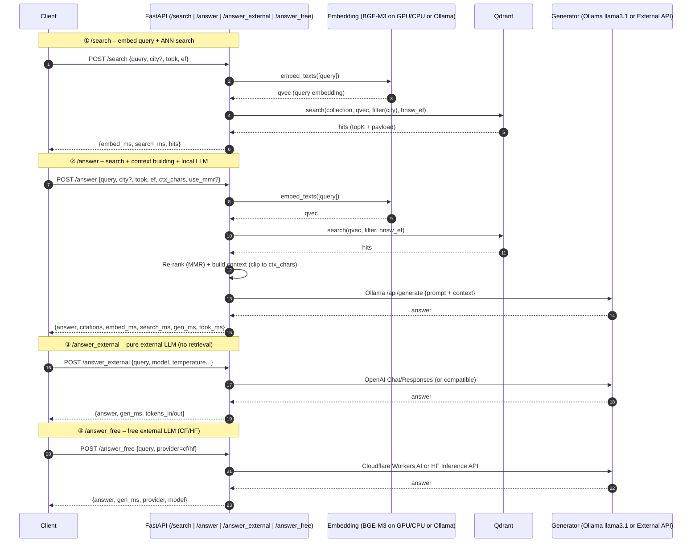

how to run : docker compose build -> docker compose up -d

# 一键启停（Docker + FastAPI）
./start.sh   # 启动 Docker (qdrant, ollama, db, web) 与 FastAPI (:8001)，FastAPI PID 写入 .uvicorn.pid
./stop.sh    # 关闭 FastAPI 并 docker compose down 

how to pull llama3.1 and run :

pull: docker exec -it ollama ollama pull llama3.1

run： docker exec -it ollama ollama run llama3.1:8b-instruct-q4_K_M "说一句中文你好"

导入 qdrant方法：

curl -s -X DELETE http://localhost:6333/collections/trip_au
//删旧集合
curl -s -X PUT http://localhost:6333/collections/trip_au \
  -H 'Content-Type: application/json' \
  -d '{"vectors":{"size":1024,"distance":"Cosine"},
       "hnsw_config":{"m":32,"ef_construct":256}}'

python test/ingest_qdrant.py

python ./test/ingest_wikivoyage_xml_to_qdrant.py --xml  ./data/raw/enwikivoyage-latest-pages-articles.xml  --collection  trip_au

python ./test/search_qdrant.py --q "从布里斯班去黄金海岸怎么坐公共交通？" --city brisbane --topk 5


fast_api 启动


# 生成向量
curl -s -X POST http://localhost:8001/embed \
  -H 'Content-Type: application/json' \
  -d '{"texts":["从布里斯班去黄金海岸怎么坐公共交通？"]}'


# 检索（按 city 过滤）
curl -s -X POST http://localhost:8001/search \
  -H 'Content-Type: application/json' \
  -d '{"query":"从布里斯班去黄金海岸怎么坐公共交通？","topk":5,"city":"brisbane"}'


# 外部 LLM 检索（与 /search 同一请求/响应格式，无需自建 RAG）
# search_claude：需设置 ANTHROPIC_API_KEY
curl -s -X POST http://localhost:8001/search_claude \
  -H 'Content-Type: application/json' \
  -d '{"query":"从布里斯班去黄金海岸怎么坐公共交通？","topk":5,"city":"brisbane"}'

curl -s -X POST http://localhost:8001/search_claude \
  -H 'Content-Type: application/json' \
  -d '{"query":"安排一下布里斯班到黄金海岸双日游？","topk":5,"city":"brisbane"}'

# search_gemini：需设置 GOOGLE_API_KEY 或 GEMINI_API_KEY
curl -s -X POST http://localhost:8001/search_gemini \
  -H 'Content-Type: application/json' \
  -d '{"query":"从布里斯班去黄金海岸怎么坐公共交通？","topk":5,"city":"brisbane"}'


# Agent 规划（扩展，开闭原则：不修改原 RAG 代码）
# 依赖：pip install langchain-core langchain-ollama
# 框架：LangChain（langchain-ollama ChatOllama + bind_tools）+ 自写 tool-calling 循环
curl -s -X POST http://localhost:8001/agent/plan \
  -H 'Content-Type: application/json' \
  -d '{"query":"从布里斯班去黄金海岸怎么坐公共交通？","max_iterations":8}'

# 基于 Claude 的 Agent（与 /agent/plan 同一请求/响应，需 ANTHROPIC_API_KEY + langchain-anthropic）
curl -s -X POST http://localhost:8001/agent/plan_claude \
  -H 'Content-Type: application/json' \
  -d '{"query":"从布里斯班去黄金海岸怎么坐公共交通？","max_iterations":8}'

# 多轮会话（session）：与 LLM 持续交流，且 LLM 做显式步骤规划（交通/景点/贴士）
# 首轮不传 session_id，响应里返回 session_id；后续请求带该 session_id 即可连续对话
# Ollama 多轮：POST /agent/chat   Claude 多轮：POST /agent/chat_claude
curl -s -X POST http://localhost:8001/agent/chat \
  -H 'Content-Type: application/json' \
  -d '{"message":"我想从布里斯班去黄金海岸玩两天"}'
# 下一轮（把上一步返回的 session_id 带上）
curl -s -X POST http://localhost:8001/agent/chat \
  -H 'Content-Type: application/json' \
  -d '{"message":"第一天下午有什么推荐景点？","session_id":"<上一步返回的 session_id>"}'

# CMD 客户端（支持 session、格式化展示 agent 输出）
python cmd_chat.py                    # Ollama 多轮对话
python cmd_chat.py --claude           # Claude 多轮对话
python cmd_chat.py --claude --show-steps   # 默认显示每轮 steps
# 输入 /quit 或 /exit 退出，/steps 切换是否显示步骤

# Agent 内 Translink 融合（本地 data/SEQ_GTFS）
# Claude/Ollama Agent 多两个工具：translink_search_stops(query)、translink_get_departures(stop_id, after_time)
# 需在项目下保留 data/SEQ_GTFS（GTFS 解压后的 stops.txt, routes.txt, trips.txt, stop_times.txt 等）
# 问 "bus from Queen Street to Central" 等 SEQ 公交时，Agent 会先查站点再查发车时刻



```mermaid
graph TD
    %% Clients
    U[Client<br/>Web/CLI/Postman] -->|HTTP JSON| API[FastAPI 服务<br/>uvicorn]

    %% Endpoints
    subgraph Endpoints
      A1[/search/]:::ep
      A2[/answer/]:::ep
      A3[/answer_external/]:::ep
      A4[/answer_free/]:::ep
    end
    API --> A1
    API --> A2
    API --> A3
    API --> A4

    %% Embedding backends
    subgraph Embedding
      EMB1[BGE-M3<br/>(FlagEmbedding)]:::svc
      EMB2[Ollama embeddings<br/>nomic-embed-text]:::svc
    end

    %% Vector DB
    VDB[(Qdrant<br/>trip_au collection)]:::db

    %% Local LLM
    LLM1[Ollama LLM<br/>llama3.1]:::svc

    %% External APIs
    subgraph External LLMs
      OAI[OpenAI Chat/Responses]:::cloud
      CF[Cloudflare Workers AI]:::cloud
      HF[HuggingFace Inference API]:::cloud
    end

    %% Data ingestion
    subgraph Ingestion Pipeline
      D1[Wikivoyage XML<br/>enwikivoyage-latest...]:::file
      D2[extract→clean→chunk]:::job
      D3[Embed (BGE/Ollama)]:::job
      D4[Qdrant upsert<br/>stable UUIDv5 ids]:::job
    end

    %% Wiring
    A1 -->|embed query| EMB1
    A1 -->|embed query| EMB2
    A1 -->|search| VDB
    A1 -->|return hits| API

    A2 -->|embed query| EMB1
    A2 -->|embed query| EMB2
    A2 -->|search topK| VDB
    A2 -->|MMR/Context| API
    A2 -->|generate| LLM1
    A2 -->|answer+citations| API

    A3 -->|prompt| OAI
    A3 -->|answer| API

    A4 -->|prompt| CF
    A4 -->|prompt| HF
    A4 -->|answer| API

    %% Ingestion flow
    D1 --> D2 --> D3 --> D4 --> VDB

    %% Styles
    classDef ep fill:#eef,stroke:#88f;
    classDef db fill:#efe,stroke:#3a3;
    classDef svc fill:#ffe,stroke:#aa8;
    classDef cloud fill:#fdf2e9,stroke:#f39c12;
    classDef job fill:#f0f0f0,stroke:#999,stroke-dasharray: 4 2;
    classDef file fill:#ddd,stroke:#777;

```