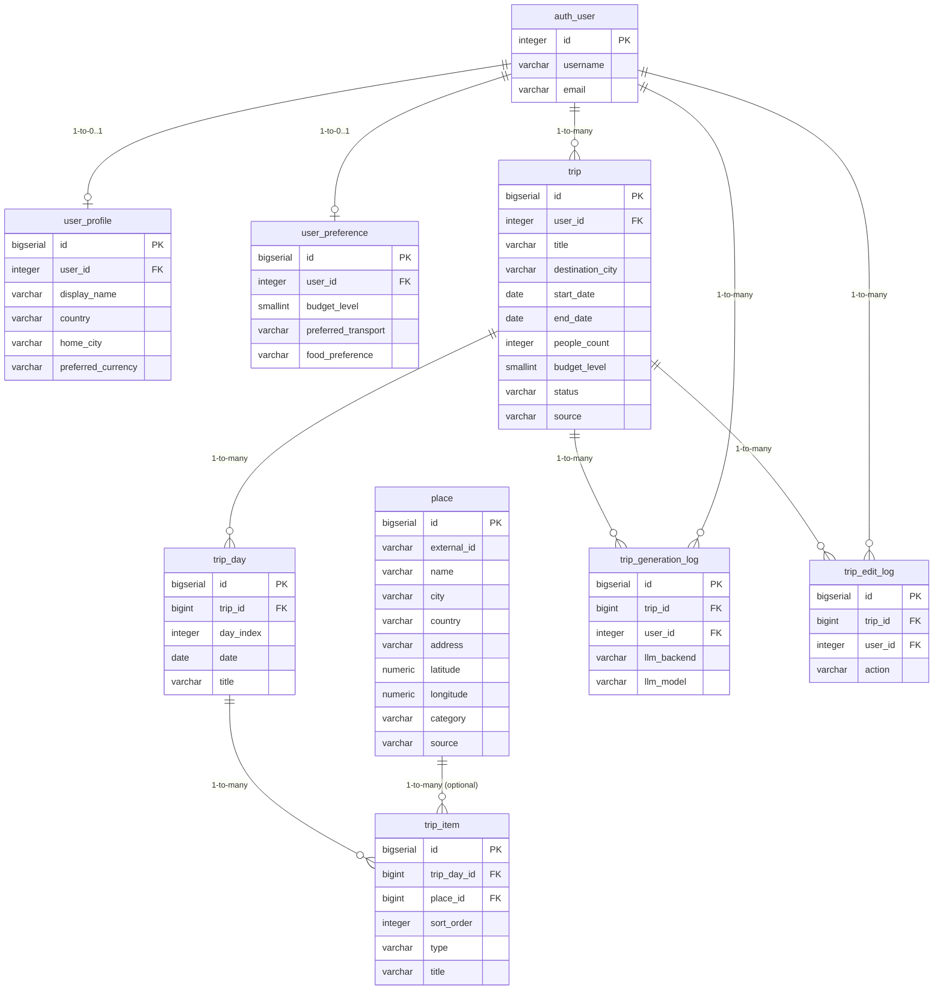

## TripPlannerBackend 数据库设计

本文件描述当前推荐的业务数据库表结构（基于 PostgreSQL + Django），以及它们之间的关系。

包含的核心表：
- `user_profile`
- `user_preference`
- `trip`
- `trip_day`
- `place`
- `trip_item`
- `trip_generation_log`
- `trip_edit_log`

---

## 1. 表结构详情

### 1.1 `user_profile`（用户扩展信息，可选）

```sql
CREATE TABLE user_profile (
    id                  BIGSERIAL PRIMARY KEY,
    user_id             INTEGER NOT NULL UNIQUE
                            REFERENCES auth_user(id) ON DELETE CASCADE,
    display_name        VARCHAR(100),
    country             VARCHAR(50),
    home_city           VARCHAR(100),
    preferred_currency  VARCHAR(10) DEFAULT 'CNY',
    created_at          TIMESTAMPTZ NOT NULL DEFAULT NOW(),
    updated_at          TIMESTAMPTZ NOT NULL DEFAULT NOW()
);
```

### 1.2 `user_preference`（用户偏好，可选）

```sql
CREATE TABLE user_preference (
    id                  BIGSERIAL PRIMARY KEY,
    user_id             INTEGER NOT NULL UNIQUE
                            REFERENCES auth_user(id) ON DELETE CASCADE,
    budget_level        SMALLINT,         -- 默认预算级别：1=省钱, 2=正常, 3=体验优先
    preferred_transport VARCHAR(50),      -- public/car/walk/mixed
    food_preference     VARCHAR(100),
    notes               TEXT,
    created_at          TIMESTAMPTZ NOT NULL DEFAULT NOW(),
    updated_at          TIMESTAMPTZ NOT NULL DEFAULT NOW()
);
```

### 1.3 `trip`（一次完整行程）

```sql
CREATE TABLE trip (
    id                  BIGSERIAL PRIMARY KEY,
    user_id             INTEGER NOT NULL
                            REFERENCES auth_user(id) ON DELETE CASCADE,
    title               VARCHAR(200) NOT NULL,
    description         TEXT,
    destination_city    VARCHAR(100) NOT NULL,
    start_date          DATE NOT NULL,
    end_date            DATE NOT NULL,
    people_count        INTEGER NOT NULL DEFAULT 1,
    budget_level        SMALLINT,                 -- 1=省钱, 2=正常, 3=体验优先
    status              VARCHAR(20) NOT NULL DEFAULT 'draft',  -- draft/confirmed/completed/cancelled
    source              VARCHAR(20) NOT NULL DEFAULT 'ai',     -- ai/manual/mixed
    created_at          TIMESTAMPTZ NOT NULL DEFAULT NOW(),
    updated_at          TIMESTAMPTZ NOT NULL DEFAULT NOW()
);

CREATE INDEX idx_trip_user_created_at
    ON trip (user_id, created_at DESC);

CREATE INDEX idx_trip_destination_city
    ON trip (destination_city);
```

### 1.4 `trip_day`（行程的第几天）

```sql
CREATE TABLE trip_day (
    id                  BIGSERIAL PRIMARY KEY,
    trip_id             BIGINT NOT NULL
                            REFERENCES trip(id) ON DELETE CASCADE,
    day_index           INTEGER NOT NULL,      -- 第几天，从 1 开始
    date                DATE NOT NULL,
    title               VARCHAR(200),
    note                TEXT,
    created_at          TIMESTAMPTZ NOT NULL DEFAULT NOW(),
    updated_at          TIMESTAMPTZ NOT NULL DEFAULT NOW(),
    CONSTRAINT uq_trip_day_unique_per_trip
        UNIQUE (trip_id, day_index)
);

CREATE INDEX idx_trip_day_trip_id
    ON trip_day (trip_id);
```

### 1.5 `place`（地点库）

```sql
CREATE TABLE place (
    id              BIGSERIAL PRIMARY KEY,
    external_id     VARCHAR(100),        -- 外部系统 id（可空）
    name            VARCHAR(200) NOT NULL,
    city            VARCHAR(100) NOT NULL,
    country         VARCHAR(100),
    address         VARCHAR(300),
    latitude        NUMERIC(9,6),
    longitude       NUMERIC(9,6),
    category        VARCHAR(50),         -- sight/museum/park/restaurant/station 等
    source          VARCHAR(50),         -- wikivoyage/manual/gtfs 等
    raw_metadata    JSONB,               -- 外部数据原始字段
    created_at      TIMESTAMPTZ NOT NULL DEFAULT NOW(),
    updated_at      TIMESTAMPTZ NOT NULL DEFAULT NOW()
);

CREATE INDEX idx_place_city
    ON place (city);

CREATE INDEX idx_place_external_id
    ON place (external_id);
```

### 1.6 `trip_item`（每天的具体活动）

```sql
CREATE TABLE trip_item (
    id              BIGSERIAL PRIMARY KEY,
    trip_day_id     BIGINT NOT NULL
                        REFERENCES trip_day(id) ON DELETE CASCADE,
    sort_order      INTEGER NOT NULL DEFAULT 0,  -- 当天内顺序
    type            VARCHAR(20) NOT NULL,        -- sightseeing/food/shopping/transport/hotel/other
    place_id        BIGINT
                        REFERENCES place(id) ON DELETE SET NULL,
    title           VARCHAR(200) NOT NULL,
    description     TEXT,
    start_time      TIME,
    end_time        TIME,
    estimated_cost  NUMERIC(10,2),
    transport_info  TEXT,                        -- 对于 type='transport'
    notes           TEXT,
    created_at      TIMESTAMPTZ NOT NULL DEFAULT NOW(),
    updated_at      TIMESTAMPTZ NOT NULL DEFAULT NOW()
);

CREATE INDEX idx_trip_item_trip_day_sort
    ON trip_item (trip_day_id, sort_order);
```

### 1.7 `trip_generation_log`（AI 生成记录）

```sql
CREATE TABLE trip_generation_log (
    id              BIGSERIAL PRIMARY KEY,
    trip_id         BIGINT NOT NULL
                        REFERENCES trip(id) ON DELETE CASCADE,
    user_id         INTEGER NOT NULL
                        REFERENCES auth_user(id) ON DELETE CASCADE,
    llm_backend     VARCHAR(20) NOT NULL,          -- ollama/claude 等
    llm_model       VARCHAR(100) NOT NULL,
    prompt          TEXT NOT NULL,                 -- 用户请求+系统提示摘要
    raw_response    TEXT,                          -- LLM 原始输出（可截断）
    used_tools      JSONB,                         -- 本次调用的工具及参数
    created_at      TIMESTAMPTZ NOT NULL DEFAULT NOW()
);

CREATE INDEX idx_trip_generation_log_trip
    ON trip_generation_log (trip_id);

CREATE INDEX idx_trip_generation_log_user
    ON trip_generation_log (user_id);
```

### 1.8 `trip_edit_log`（行程编辑记录）

```sql
CREATE TABLE trip_edit_log (
    id              BIGSERIAL PRIMARY KEY,
    trip_id         BIGINT NOT NULL
                        REFERENCES trip(id) ON DELETE CASCADE,
    user_id         INTEGER NOT NULL
                        REFERENCES auth_user(id) ON DELETE CASCADE,
    action          VARCHAR(50) NOT NULL,      -- add_item/delete_item/update_item 等
    before_state    JSONB,
    after_state     JSONB,
    created_at      TIMESTAMPTZ NOT NULL DEFAULT NOW()
);

CREATE INDEX idx_trip_edit_log_trip
    ON trip_edit_log (trip_id);

CREATE INDEX idx_trip_edit_log_user
    ON trip_edit_log (user_id);
```

---

## 2. 实体关系图（ER Diagram）

下面是上述表之间关系的概览，使用 Mermaid ER 图表示：



> 说明：`auth_user` 为 Django 自带用户表，仅在关系图中简化展示关键字段，实际字段以 Django 默认迁移为准。

